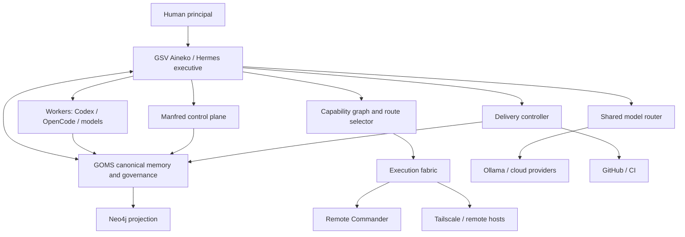

# Exocortex Architecture Overview

## Purpose

The Exocortex is a composition of durable memory, executive agency, replaceable model cognition, governed execution, and persistent task orchestration. Its purpose is not to maximize automation for its own sake. It exists to increase useful human capability while reducing attention spent on reconstruction, coordination, supervision, and mechanical execution.

## Architectural layers

## Authority separation

The architecture deliberately separates three decisions that are often collapsed:

1. **What is true / what state is canonical?**  
   GOMS and external deterministic systems such as GitHub/CI own this.

2. **Which cognitive substrate should reason about the task?**  
   The shared model router owns this selection using eligibility, qualification, lifecycle, cost, context, privacy and evidence.

3. **What is authorised to change the world?**  
   Local authority modes, the capability graph, route selector, typed controllers and operating-system policy own this.

A stronger model never receives stronger machine authority merely because it is stronger.

## Core authorities

### GSV Aineko / Hermes

The persistent executive personality. It interprets intent, reconstructs context, selects existing authorities, delegates, supervises, verifies, persists outcomes, and protects human attention.

Hermes is the runtime shell. GSV Aineko is the durable Exocortex identity and doctrine encoded in `hermes/SOUL.md` and Exocortex skills.

### GOMS

Canonical durable semantic state and provenance. It owns project state, claims, evidence, decisions, branches/checkpoints, failures, control intents, capability history and context synthesis.

SQLite/event provenance is canonical. Neo4j is a replaceable graph projection.

### Shared model router

The cognitive-substrate authority. It filters candidates on hard eligibility, then ranks qualified routes. It understands model lifecycle, retirement, privacy, tool use, context, evidence, latency, cost class and cold-start preference.

### Execution fabric

A discovered graph of healthy authorised effectors. Current routes include local machine tools, Remote Commander and Tailscale-reachable routes.

The route selector handles failed-route recovery before escalating to the human.

### Local authority modes

`OBSERVE < OPERATE < ADMIN < RECOVERY < EMERGENCY`

These are ceilings, not instructions. Elevation does not approve HUMAN_ONLY control intents. Recovery authority must remain available even if GOMS is unavailable.

## Persistent controllers

The Exocortex uses deterministic persistent controllers where waiting/state is more important than reasoning:
- delivery controller;
- GOMS distillation queue and workers;
- semantic daemon;
- topology controller;
- infrastructure health controller;
- cognition health controller;
- guardian review;
- Manfred read/control/authority services.

This avoids spending model tokens merely to remember that something is waiting.

## Replaceable components

The following may change without redefining the Exocortex:
- LLM provider/model;
- graph database;
- embedding model/vector store;
- messaging surface;
- code agent;
- machine execution transport;
- scheduling implementation;
- visualization/UI.

They are valuable substrates, not canonical meaning.

## External-state boundary

GitHub reconstructs the software and configuration contracts. It does not contain:
- canonical lived GOMS state;
- secrets;
- WhatsApp sessions;
- bearer tokens;
- authority audit/private material;
- large model blobs.

See `docs/reconstruction/STATE_AND_SECRETS.md`.

## Current portability status

macOS is the only fully exercised host. Current live service management uses launchd. Systemd and clean-machine second-host acceptance remain portability work.

The repository is still sufficient to explain the required service graph and rebuild each component manually, which is the survivability floor. The long-term target is full automated bootstrap from the same manifests.
